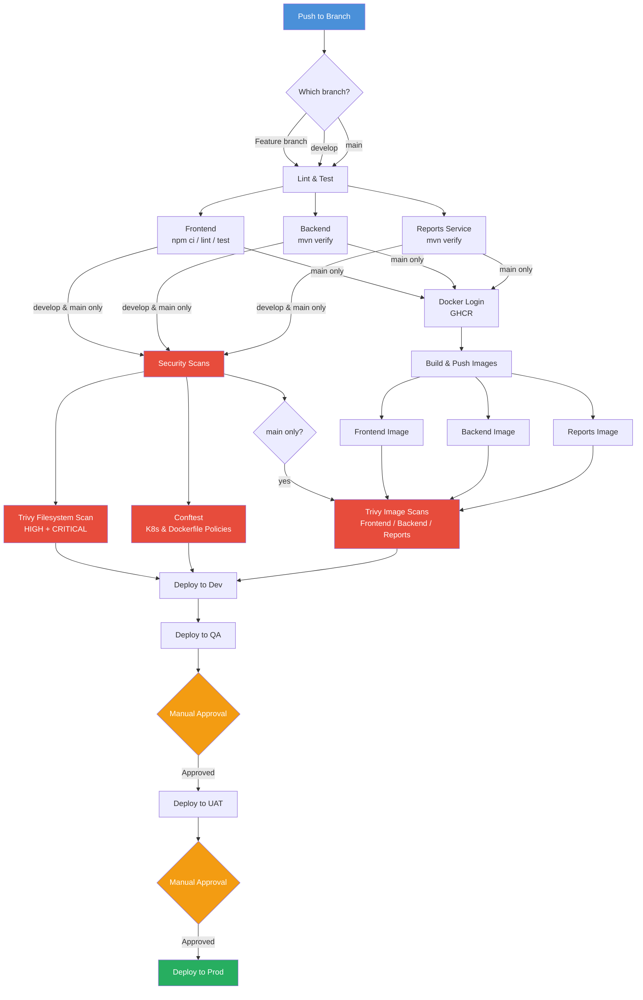

# Pipeline Diagrams

## CI/CD Pipeline Flow

```mermaid
flowchart TD
    A[Push to Branch] --> B{Which branch?}

    B -->|Feature branch| C[Lint & Test]
    B -->|develop| C
    B -->|main| C

    C --> C1[Frontend<br>npm ci / lint / test]
    C --> C2[Backend<br>mvn verify]
    C --> C3[Reports Service<br>mvn verify]

    C1 & C2 & C3 -->|develop & main only| D[Security Scans]

    D --> D1[Trivy Filesystem Scan<br>HIGH + CRITICAL]
    D --> D2[Conftest<br>K8s & Dockerfile Policies]
    D --> D3{main only?}

    D3 -->|yes| D4[Trivy Image Scans<br>Frontend / Backend / Reports]

    C1 & C2 & C3 -->|main only| E[Docker Login<br>GHCR]
    E --> F[Build & Push Images]

    F --> F1[Frontend Image]
    F --> F2[Backend Image]
    F --> F3[Reports Image]

    F1 & F2 & F3 --> D4

    D1 & D2 & D4 --> G[Deploy to Dev]
    G --> H[Deploy to QA]
    H --> I{Manual Approval}
    I -->|Approved| J[Deploy to UAT]
    J --> K{Manual Approval}
    K -->|Approved| L[Deploy to Prod]

    style A fill:#4a90d9,color:#fff
    style D fill:#e74c3c,color:#fff
    style D1 fill:#e74c3c,color:#fff
    style D2 fill:#e74c3c,color:#fff
    style D4 fill:#e74c3c,color:#fff
    style I fill:#f39c12,color:#fff
    style K fill:#f39c12,color:#fff
    style L fill:#27ae60,color:#fff
```

## Security Enforcement Layers

```mermaid
flowchart LR
    subgraph "Layer 1: Source Control"
        A1[CODEOWNERS] --> A2[Branch Protection]
    end

    subgraph "Layer 2: CI Pipeline"
        B1[Jenkins Shared Library] --> B2[Security Scans<br>Trivy + Conftest]
    end

    subgraph "Layer 3: Cluster Admission"
        C1[OPA Gatekeeper] --> C2[Reject Non-Compliant<br>Resources]
    end

    subgraph "Layer 4: Image Trust"
        D1[Cosign Signing] --> D2[Sigstore Policy<br>Controller]
    end

    A2 --> B1
    B2 --> C1
    C2 --> D1

    style A1 fill:#3498db,color:#fff
    style A2 fill:#3498db,color:#fff
    style B1 fill:#e74c3c,color:#fff
    style B2 fill:#e74c3c,color:#fff
    style C1 fill:#f39c12,color:#fff
    style C2 fill:#f39c12,color:#fff
    style D1 fill:#27ae60,color:#fff
    style D2 fill:#27ae60,color:#fff
```
